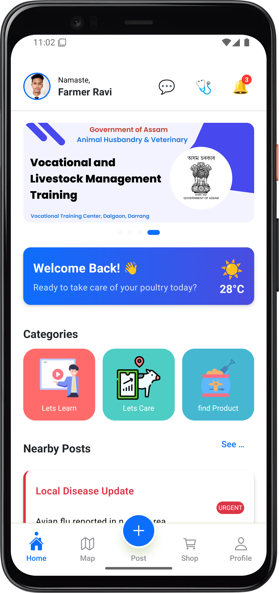

# Pashunestha App

Pashunestha is a mobile application designed to support farmers in Assam, India, in their animal husbandry and veterinary needs. This app, developed in collaboration with the Government of Assam, provides a comprehensive platform for vocational training, livestock management, and community support.

## Features

-   **Vocational Training:** Access training materials and resources for livestock management.
-   **Lets Care:** A feature to help farmers take care of their poultry and other livestock.
-   **Marketplace:** Find and sell products related to farming and animal husbandry.
-   **Disease Updates:** Get real-time alerts about local disease outbreaks to protect your livestock.
-   **Community Posts:** Connect with other farmers and experts through nearby posts.
-   **Map Integration:** Find nearby resources and services.
-   **Profile Management:** Keep track of your activities and manage your profile.

## Screenshot



## Getting Started

This is a React Native project created with Expo.

### Prerequisites

-   Node.js
-   Expo CLI

### Installation

1.  Clone the repository:
    ```sh
    git clone <repository-url>
    ```
2.  Install NPM packages:
    ```sh
    npm install
    ```
3.  Start the application:
    ```sh
    npm start
    ```
